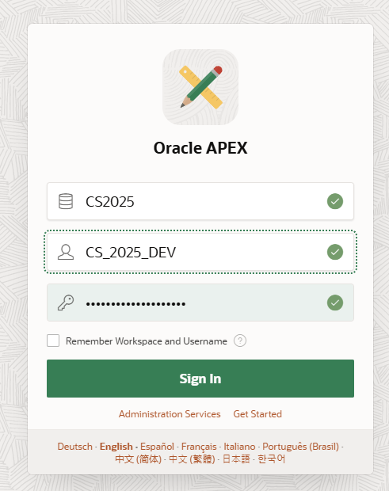

**Laboratorní úlohy pro administraci Oracle APEX**

### 1. Správa uživatelských účtů a přístupových práv
**Cíl:** Naučit se vytvářet, spravovat a odebírat uživatelské účty a nastavovat oprávnění.

Přihlaste se do https://cloud.oracle.com/

Přejdete na Apex instances

Vyberte vaši instanci Apexu

Launch APEX

**Úkoly:**  
1. Přihlaste se do Oracle APEX jako administrátor workspace internal. Uživatel admin, heslo - vytvořené v kroku 5 Vytvoření APEX instance. 

2. Vytvořte nového uživatele s rolí "Developer".

3. Přihlaste se jako nově vytvořený uživatel a zkuste vytvořit novou aplikaci

---

### 2. Změna hesel
**Cíl:** Seznámit se s procesem změny hesla a obnovy hesla v APEX.

**Úkoly:**  
1. Přihlaste se jako administator workspace - CS2025_admin
2. Otevřte položku Manage User and Groups

3. Zvolte uživatele CS2025_DEV

4. Změnte mu heslo
5. Zkuste se příhlasit se změněným heslem
6. Lze nastavit povinnost uživatele změnit heslo - checkbox Expire Password

**Ověření:**  
- Přihlaste se s novým heslem a ověřte jeho funkčnost.

---

### 3. Zálohování - TODO
**Cíl:** Naučit se zálohovat a obnovovat aplikace a pracovní prostory v APEX.

**Úkoly:**  
1. Exportujte aplikaci jako záložní soubor.
2. Exportujte celý workspace.
3. Importujte zálohu do jiné instance APEX.
4. Ověřte funkčnost aplikace po obnovení.

**Ověření:**  
- Spusťte aplikaci po obnovení a ověřte její funkčnost.

---

### 4. Bezpečnost / SSO
**Cíl:** Nastavit a konfigurovat Single Sign-On (SSO) v APEX.

**Úkoly:**  
1. Nakonfigurujte autentizaci přes SSO.
2. Přidejte externího poskytovatele identity (např. LDAP, OAuth2).
3. Ověřte funkčnost přihlašování přes SSO.

**Ověření:**  
- Přihlaste se pomocí SSO a ověřte přístup k aplikacím.

---

### 5. Změna certifikátů
**Cíl:** Vyměnit SSL certifikát pro APEX a ověřit jeho správnost.

**Úkoly:**  
1. Nahrajte nový SSL certifikát do Oracle Wallet.
2. Nakonfigurujte APEX tak, aby používal nový certifikát.
3. Ověřte správnost certifikátu pomocí prohlížeče a nástroje `openssl`.

**Ověření:**  
- Přistupte k APEX přes HTTPS a ověřte platnost certifikátu.
- Použijte `openssl s_client -connect <hostname>:443` k ověření SSL certifikátu.

---

Tyto laboratorní úlohy pokrývají klíčové aspekty administrace Oracle APEX a mohou být upraveny podle konkrétních potřeb.

