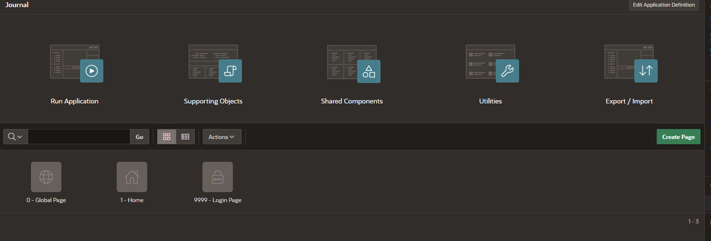
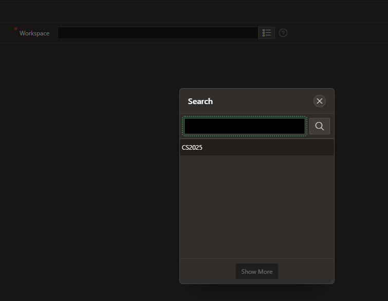

**Laboratorní úlohy pro administraci Oracle APEX**

### 1. Správa uživatelských účtů a přístupových práv
**Cíl:** Naučit se vytvářet, spravovat a odebírat uživatelské účty a nastavovat oprávnění.

Přihlaste se do https://cloud.oracle.com/

Přejdete na Apex instances

Vyberte vaši instanci Apexu

Launch APEX

**Úkoly:**  
1. Přihlaste se do Oracle APEX jako administrátor workspace internal. Uživatel admin, heslo - vytvořené v kroku 5 Vytvoření APEX instance. 

2. Vytvořte nového uživatele s rolí "Developer".

3. Přihlaste se jako nově vytvořený uživatel a zkuste vytvořit novou aplikaci

---

### 2. Změna hesel
**Cíl:** Seznámit se s procesem změny hesla a obnovy hesla v APEX.

**Úkoly:**  
1. Přihlaste se jako administator workspace - CS2025_admin
2. Otevřte položku Manage User and Groups

3. Zvolte uživatele CS2025_DEV

4. Změnte mu heslo
5. Zkuste se příhlasit se změněným heslem
6. Lze nastavit povinnost uživatele změnit heslo - checkbox Expire Password

**Ověření:**  
- Přihlaste se s novým heslem a ověřte jeho funkčnost.

---

### 3. Zálohování - Export/Import + Github
**Cíl:** Naučit se zálohovat a obnovovat aplikace a pracovní prostory v APEX.

**Úkoly:**  
* Přihlaste se do APEXu jako CS2025_admin

* Vytvořte novou aplikaci

* Zvolte Export/import

* Export
* Zvolte true pro Readable format, Split into Multiple Files, Original IDs - true

* Zmačkněte Export

* Rozbalte archiv s aplikaci a zkopirujte aplikaci do adresáře s Váším git repositářem, např. ...\GitHub.com\apex_workshop_CS_2024\apps\Journal\
* Nahrejte aplikaci do Gitu

* Udělejte změnu v aplikaci, např. přidejte text na Home page

* Zopakujte export, rozbalte aplikaci do stejného adresáře jako minule, např. např. ...\GitHub.com\apex_workshop_CS_2024\apps\Journal\. 
Podivejte se na změny ve Vášem Git klientu - např. Github Deskop

* Smažte aplikaci

* Zabalte aplikaci z gitu do archivu, např. Journal.zip
* Naimportujte aplikaci zpět do APEXu

* 

* Spusťte aplikaci

### 4. Zálohování - Pravidelné zálohy
* Otevřte Worspace Utilities/Manage Backups

* Zvolte aplikaci

* Vytvořte backup

* Stahněte backup

* Proveďtě změnu v aplikaci, např. přidejte novou stránku

* Otevřte Manage backups

* Zvolte Restore Backup

* Zkontrolujte, že nová stránka už v aplikaci není

### 5. Zálohování - počet záloh
* Přihlaste se do workspace Internal
* Manage Instance, Feature Configuration, Application Development,
Number of backups per application

Monitor activity - Backup log

### 6. Zálohování workspace
* Přihlaste se do workspace Internal

* Manage workspaces/Export workspace

Pozor, export workspace obsahuje jenom uživatele workspacu, neobsahuje schémata a aplikace. 

### 4. Bezpečnost / SSO
**Cíl:** Nastavit a konfigurovat Single Sign-On (SSO) v APEX.

**Úkoly:**  
1. Nakonfigurujte autentizaci přes SSO.
2. Přidejte externího poskytovatele identity (např. LDAP, OAuth2).
3. Ověřte funkčnost přihlašování přes SSO.

**Ověření:**  
- Přihlaste se pomocí SSO a ověřte přístup k aplikacím.

---

### 5. Změna certifikátů
**Cíl:** Vyměnit SSL certifikát pro APEX a ověřit jeho správnost.

**Úkoly:**  
1. Nahrajte nový SSL certifikát do Oracle Wallet.
2. Nakonfigurujte APEX tak, aby používal nový certifikát.
3. Ověřte správnost certifikátu pomocí prohlížeče a nástroje `openssl`.

**Ověření:**  
- Přistupte k APEX přes HTTPS a ověřte platnost certifikátu.
- Použijte `openssl s_client -connect <hostname>:443` k ověření SSL certifikátu.

---

Tyto laboratorní úlohy pokrývají klíčové aspekty administrace Oracle APEX a mohou být upraveny podle konkrétních potřeb.

