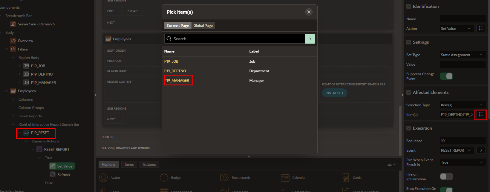

# Lab: JavaScript v Oracle APEX

V tomto labu si procvičíme práci s JavaScriptem v Oracle APEX. Naučíme se identifikovat položky stránky pomocí inspektoru prohlížeče a zjistíme, jak číst a nastavovat hodnoty těchto položek pomocí JavaScriptu.

## Předpoklady
- Přihlaste se do [apex.oracle.com](https://apex.oracle.com/) pomocí svého účtu.
- Přejděte do sekce Gallery a nainstalujte aplikaci **Sample Dynamic Actions**.

## Kroky

### 1. Otevření aplikace
- Po instalaci aplikace ji spusťte a přejděte na stránku **Disable/Enable** (nachází se v menu aplikace).

### 2. Výběr prvního řádku
- Na stránce **Disable/Enable** vyberte možnost **Edit** (tužku) u prvního řádku.

### 3. Použití inspektoru prohlížeče
- Otevřete vývojářskou konzoli prohlížeče (klávesová zkratka F12).
- Použijte inspektor (nástroj pro prohlížení elementů na stránce) a zkuste najít název položky stránky odpovídající štítku **Name**. Tento název bude obvykle ve formátu `P3_ENAME`.

### 4. Čtení hodnoty pomocí JavaScriptu
- V konzoli prohlížeče zadejte následující příkaz k přečtení aktuální hodnoty položky `P3_ENAME`:

  ```javascript
  $v("P3_ENAME");

### 5. Nastavení hodnoty pomocí JavaScriptu
- Dále zkusíme nastavit novou hodnotu pro `P3_ENAME`. Do konzole prohlížeče zadejte tento příkaz:

  ```javascript
  apex.item("P3_ENAME").setValue("KRAL");


Po spuštění příkazu by se hodnota P3_ENAME měla změnit na KRAL.

### Cvičení 2: Dynamické akce - povolit úpravu / zakázat úpravu pole

1. **Vytvoření nové stránky typu Form**:
   - Přejděte do aplikace **Sample Dynamic Actions**.
   - Vytvořte novou stránku typu **Form** a vyberte tabulku **eba_demo_da_emp** jako zdroj dat.
   
   
   
   

2. **Úprava Page Item `Pxx_JOB`**:
   - Na nové stránce najděte položku `Pxx_JOB` a změňte její typ z **Text Field** na **Select List**.

   
   - Jako zdroj položky `Pxx_JOB` zvolte následující SQL dotaz:

     ```sql
     select distinct job d, job r 
     from eba_demo_da_emp
     order by 1;
     ```

   
3. **Definování nové dynamické akce pro `Pxx_JOB`**:
   - Na položce `Pxx_JOB` vytvořte novou dynamickou akci a pojmenujte ji **Commission for Salesman Only**.

    
   - Nastavte následující parametry pro dynamickou akci:
      - **Event**: `Change`
      - **Client-side Condition**: `Item = Value`
      - **Item**: `Pxx_JOB`
      - **Value**: `SALESMAN`

  

4. **Přidání True Action**:
   - Přidejte **True Action** s následujícími parametry:
      - **Action**: `Enable`
      - **Items**: `Pxx_COMM`

  

5. **Vytvoření opačné akce**:
   - Pravým tlačítkem myši klikněte na **True Action** a vyberte **Create Opposite Action**.

  
   - Tím se automaticky vytvoří **False Action**, která zajistí, že pole `Pxx_COMM` bude zakázáno, pokud není vybráno `SALESMAN`.

6. **Otestování stránky**:
   - Spusťte stránku a otestujte, zda dynamická akce funguje správně:
      - Při výběru **Job = Salesman** by mělo být pole **Commission** povoleno pro úpravy.
      - Pokud je vybrána jiná hodnota, pole **Commission** by mělo být zakázáno.

  


Další příklad - viz Aplikace Sample Dynamic Actions

### Cvičení 3: Dynamické akce - změna CSS třídy

* Otevřte aplkaci Sample Dynamic Actions
* Vyzkoušejte příklad Style-Add/Remove Class (Error)
* Přejdete na zdroj stránky a změnte Class z validation_error na jinou třídu. (Seznam dostupných stylů najdete zde (https://apex.oracle.com/pls/apex/r/apex_pm/ut/color-and-status-modifiers))


### Cvičení 4: Dynamické akce - Příklad Style-Add/Remove Class (Focus) 
### Cvičení 5: Dynamické akce - Příklad Server Side/ Execute PL/SQL code - podivat se na implementaci.

### Cvičení 6: Dynamické akce - Příklad Server Side/ Set Values (PL/SQL)
* Přidat zabarvení pole Commission po změně pole Salary
   * P15_JOB - Přídat další True akci - Highlight commision - Add Class, Class = u-color-4-bg
   * Nová dynamická akce - na úrovni regionu - On Mouse Click - Remove Class u-color-4-bg
### Cvičení 7: Dynamické akce - Příklad Server Side/ Filter and Refresh - přidat dalši filtr - Manager
* 
   * Očekáváný výsledek:

   
#### Řešení 
   * Přidat nový page item  = P19_MANAGER, typ Select List. List of Values/Type = Shared Component - Manager


Varianta 1 - do existující dynamické akce FILTER REFRESH (na P19_JOB nebo P19_DEPTNO) přídat další item P19_MANAGER


Varianta 2 - vytvořít novou dynamickou akci FILTER REFRESH


Umístít P19_MANAGER za P19_DEPTNO


Změnit template na Optional Above


   * Upravit query v Interactive Reportu - Employees
```
   SELECT e.ROWID
,      e.EMPNO
,      e.ENAME
,      e.JOB
,      m.ename MGR
,      e.HIREDATE
,      e.SAL
,      e.COMM
,      d.dname DEPTNO
FROM EBA_DEMO_DA_EMP e
,    EBA_DEMO_DA_EMP m
,    EBA_DEMO_DA_DEPT d
WHERE e.mgr = m.empno (+)
AND   e.deptno = d.deptno (+)
AND   e.deptno = nvl(:P19_DEPTNO, e.deptno)
AND   e.job = nvl(:P19_JOB, e.job)
AND   m.EMPNO = nvl(:P19_MANAGER, m.EMPNO); -- nová podmínka
```
* Zkusít pustit a ověřit, zda filtr funguje

* Nefunguje, proč? 

* Přídat P19_MANAGER do items to submit SQL Query Employees Interactive Reportu 


* Přidat P19_MANAGER do Items na dynamické akci RESET REPORT 


### Cvičení 8: Dynamické akce - Complex - Delete and Refresh - podivat se na implementaci

### Cvičení 9: Aplikace CS_workshop_2024-11 - Příklad Interactive Grid - podivat se na implementaci
* Nainstalujte si do workspacu Sample DataSet EMP/DEPT - SQL Workshop/Utilities/Sample Data Sets 

* Import aplikace CS_workshop_2024-11 GitHub.com\apex_workshop_CS_2024\apps\CS_workshop_2024-11\
* Příklad demonstruje, jak se dá upravit Interactive Grid pomocí javascriptu
* Otevřte InteractiveGrid - attributes/Initialization JavaScript Function

Zdrojový kód k přidání tlačitek reportu
[text](../../examples/javascript/ig_options.js)
Zdrojový kód k přidání tlačítka Calculte price
[text](../../examples/javascript/ig_options_calculate_price.js)

Dokumentace k Oracle APEX JavaScript API - 
https://docs.oracle.com/en/database/oracle/apex/24.2/aexjs/index.html
https://docs.oracle.com/en/database/oracle/apex/24.2/aexjs/interactiveGrid.html


### Cvičení 10: Aplikace CS_workshop_2024-11 - Příklad EMPs - podivat se na implementaci
Opakování principů z příkladu [Cvičení 7](#cvičení-7-dynamické-akce---příklad-server-side-filter-and-refresh---přidat-dalši-filtr---manager)

### Cvičení 11: Aplikace CS_workshop_2024 - Statické soubory

* Nahrajte tento [soubor](../../examples/javascript/igUtil.js) do statických souborů v Shared Components aplikace CS_workshop_2024.

Shared Components/Static Application Files/


Uložte si referenci na soubor #APP_FILES#igUtil.js


Otevřte stánku Emps v aplikaci a přidejte do Javascript/FileURLs odkáz na #APP_FILES#igUtil.js


* Přidejte IG Emps static Id - ig_emps

* Přidejte nový Page Item P2_SELECTED_EMP  Type - hidden. Value Protected - False


* Přidejte nové tlačitko Zamestnanec roku

* Vytvořte novou dynamickou akci na tlačitku - Click


* Přidejte novou akci Execute JavaScript Code. Code:

``` javascript
if (!igUtil.selectedPK("ig_emps", "P2_SELECTED_EMP", "Vyberte jenom jednoho zamestance!"))
  {
    // The function will return FALSE if the user does not select at least one entity. apex.da.cancel() will stop the subsequent steps in the Dynamic Action from running.
    apex.da.cancel();
  }
```
* Přidejte novou akci Alert. Message:

```
Zamestnancem roku se stava zamestnanec cislo &P2_SELECTED_EMP.
```
* Přidejte novou akci Execute Server-side Code. PL/SQL Code: 

``` sql
update emp set ename = '* '||ename where empno = :P2_SELECTED_EMP;
```
* Do Items to submit přidejte P2_SELECTED_EMP

* Přidejte novou akci Refresh - Selection type = Region, Region = Emps


