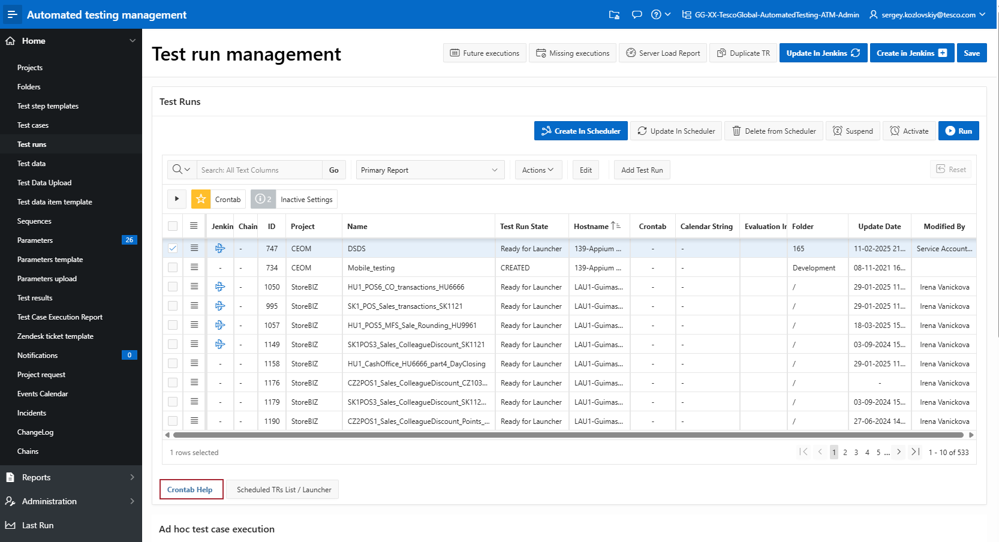

# ATM

---

# ATM - systém pro správu automatizovaných testů

---

# High level datový model

---

# Celý datový model

---

# Test case management
* generování zdrojového kódu do GitHub (Rest API)
* generování Jenkins jobů (HTTP request)
* odkázy na Jenkins

---

# Zdrojový kód test casu

---

# Test run management 
* spuštění test casu z test runu - viz Javascript lab

---

# Test data
* Clone test data

---

# Test parameters
* Uložení hesel, master key

---

# Test case execution report
* Odkáz na html report, video

# Složky
* Tree view

---

# Event Calendar
* Kalendář

---
# Ukázka

---
# Vývoj ATM

* Datový model - Oracle Data Modeller
* Verzování v GitHubu
* Change log v aplikaci
* Skript na instalaci APEXu
* Výroba patchů
* Release
* Řizení vývoje - JIRA
* Release management - JIRA

