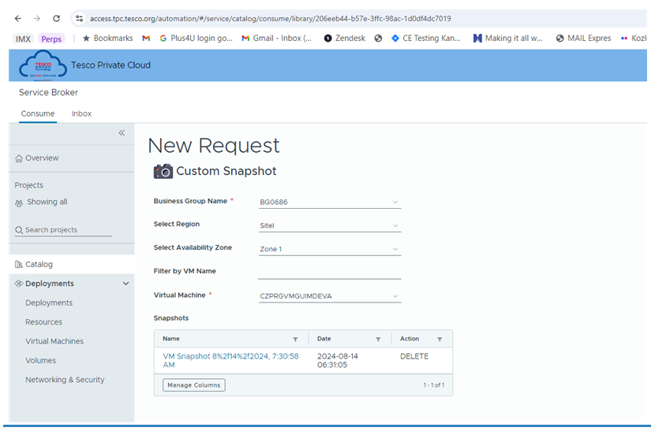

# Drobná administrace APEXu

---

## Správa uživatelských účtů a přístupových práv

### Uživatele APEXu
- APEX admin - workspace internal - vytváří workspacy, správuje celé prostředí
- Workspace admin - vytváří uživatele, spravuje workspace
- Worspace developer - vývoj aplikací
- Runtime uživatel - nemá práva na vývoj

[Lab 1 - Správa uživatelských účtů a přístupových práv ](../../labs/Administration/Administation.MD)

---
### Zálohování
* Záloha databáze
* Záloha virtuálního stroje
* Export aplikace do souboru
* Pravidelné zálohování aplikace v APEXu

---
### Záloha virtuálního stroje
* Napřiklad před upgradem na novou verzi APEXu

--- 

### Export aplikace do souboru

* Po káždé změně - export a uložení do gitu
[Cvičení 3](../../labs/Administration/Administation.MD)

---

### Pravidelné zálohování aplikace v APEXu
[Cvičení 4](../../labs/Administration/Administation.MD)

