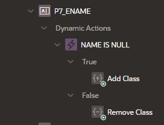
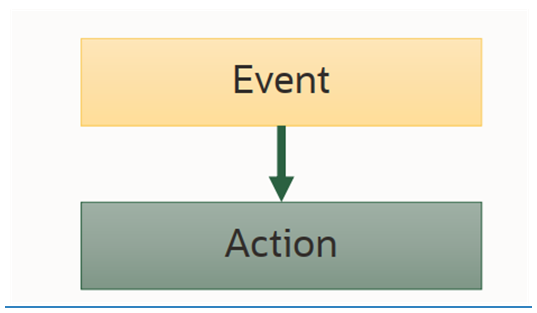
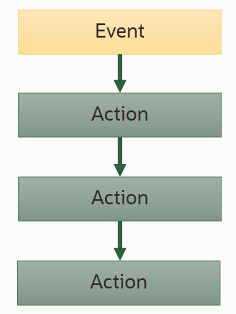
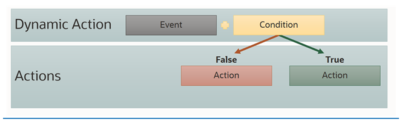
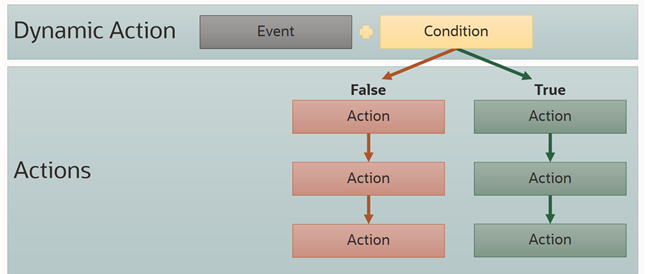
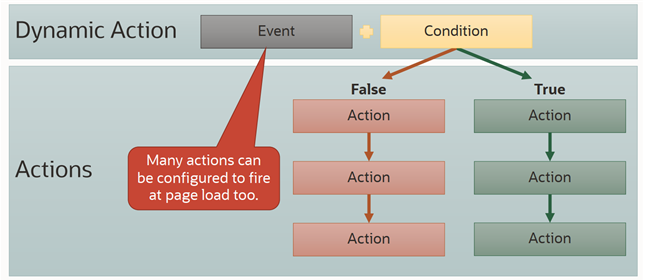

# JavaScript v APEXu

---
# Práce s APEX položkami (page items)

Získání hodnoty z položky: 
``` 
```javascript
$v("P1_ITEM");
apex.item("P1_ITEM").getValue();
```

Nastavení hodnoty položky:
``` 
$s("P1_ITEM", "Nová hodnota");
apex.item("P1_ITEM").setValue("Nová hodnota");
``` 

---
# Dynamické akce 

Deklarativní způsob, jak přidat dynamické chování na stránku

* Nakonfigurujte atributy pro určení toho, co se stane a kdy
* APEX vygeneruje JavaScript a přidá ho na stránku

---
# Dynamické akce: dvě části
* Dynamická akce - událost a související komponenta (klik na tlačítko).  
* Akce: reakce, jako například 'skrýt' nebo 'zobrazit' (hide, show).

--- 
# Dynamické akce


---

# Dynamické akce


---
# Dynamické akce


---
# Dynamické akce


---
# Dynamické akce 


---
# Lab 
[JavaScript v APEXu](../../labs/javascript/labs_javascript_in_APEX.MD)
---
