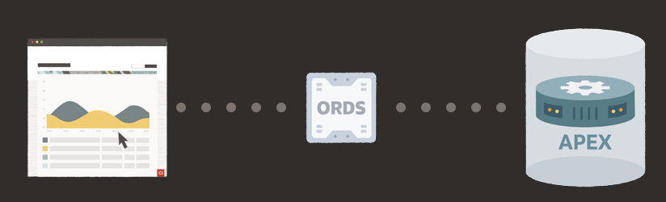
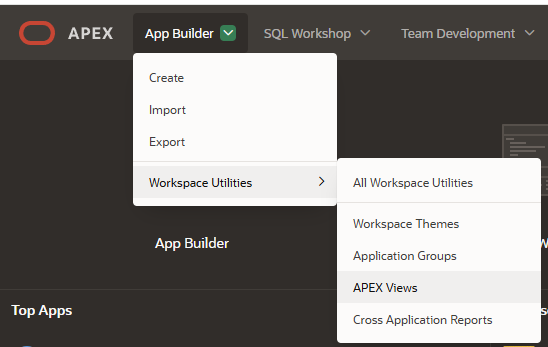
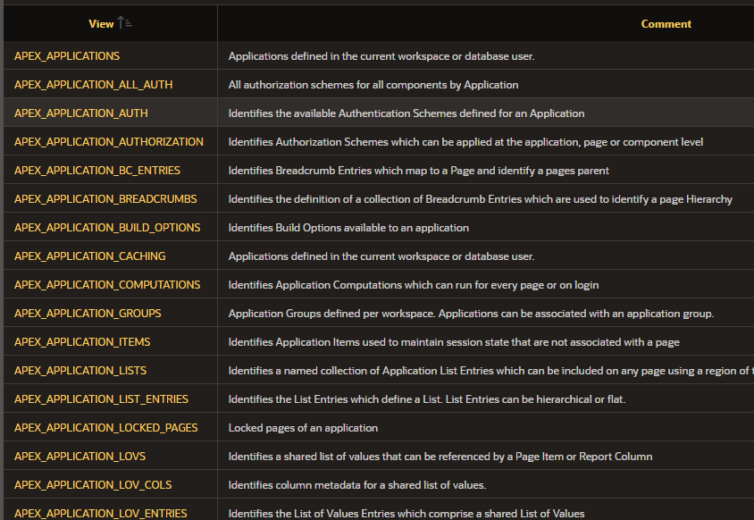
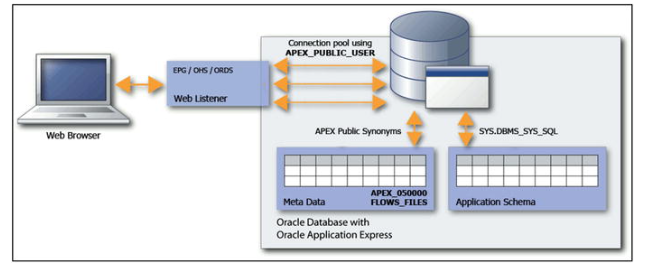

# Oracle APEX Workshop pro ČS

---

## Úvod

- **O mně:** Sergej Kozlovskij
- **Vývoj v Oracle od roku 2000 (s přestávkami :smiley: )**
- **Vývoj v APEXu od 2019 - vývoj aplikace ATM (správa automatických testů) pro Tesco** 


- Představení účastníků

---

## Cíl workshopu

- Seznámení s architekturou a možnostmi APEXu
- Procvičit základní administrativní úkony
- Ukázat/vyzškoušet možnosti přizpůsobení aplikací pomocí JavaScriptu,  dynamických akcí a CSS
- Ukázat zajimavé příklady využítí - ukázka ATM

---


# Architektura Oracle APEX

---


# 1. Úvod do Oracle APEX

- **Co je Oracle APEX?**
  - Low-code platforma pro tvorbu škálovatelných, bezpečných a vizuálně atraktivních aplikací.
  - Integrovaná do Oracle Database – využívá PL/SQL a metadata k dynamickému generování stránek.
  - Součást Oracle RAD Stack (ORDS, APEX, Database)
- **Klíčové vlastnosti:**
  - Rychlý vývoj díky deklarativnímu prostředí a předpřipraveným komponentam (Interactive Grid, Interactive Report, další UI komponenty).  
---

# 2. Základní architektura Oracle APEX

- **3-vrstvá architektura:**

  1. **Webový prohlížeč:** Uživatel zadá URL (např. `http://<hostname>/ords/f?p=<appid>:<pageid>`).
  2. **ORDS:** Překládá požadavky (HTTP requesty) na databázová volání.
  3. **Oracle Database:** APEX engine zpacovává požadavky, generuje a posílá zpět webové stránky
---

# 3. Metadata

* Při vytvoření/rozšíření aplikace APEX ukládá metadata do databázových tabulek pomocí uložených procedur v packagích APEX_xxx
* Engine APEX čte metadata pro zobrazení stránek a zpracování požadavků
* Správa stavu relace (session state) v databázi
* PL/SQL manipuluje daty přímo v databázi
* Výsledky odesílány do prohlížeče jedním API voláním a vraceny jednou odpovědi


---
# 4. Databázová schémata v APEX

- **Základní schémata:**
  1. **APEX_PUBLIC_USER:** Připojení a provoz aplikací (musí být odemčený).
  2. **FLOWS_FILES:** Dočasné soubory (WWV_FLOW_FILE_OBJECTS$).
  3. **APEX_xxxx:** APEX engine a metadata (např. pro verzi 23 APEX_230000).
- **APEX views** - pohledy do metadat, viz APEX_DICTIONARY
- **Aplikační schéma:**
  - Ukládá data a logiku aplikace, přístup pouze přes APEX engine. (např. GUIM schéma v ATM)

---
# 5. APEX views - 1
* APEX_DICTIONARY
* Nebo APEX App builder/Workspace Utilities/APEX Views

--- 
# 5. APEX views - 2

---

--- 
# 5. APEX views - 3
```sql
select distinct apex_view_name from APEX_DICTIONARY order by 1;
``` 
<!--
all the locked pages of all the applications in all the workspaces for a particular user
-->
Uzamčené stránky a kdo je uzamčel
```sql
select workspace_display_name
      ,application_id
      ,page_id
      ,locked_by
      ,locked_on
from apex_application_locked_pages

WORKSPACE_ APPLICATION_ID    PAGE_ID LOCKED_BY  LOCKED_ON
---------- -------------- ---------- ---------- ---------
DEMO                      100        1 ADMIN    08-JUN-16
DEMO                      100        2 ADMIN    08-JUN-16
``` 
---
# 5. APEX views - 4
Vyber všechny sdílené LOV, které nemají „ORDER BY“.
```sql
select application_id
      ,list_of_values_name
      ,list_of_values_query
from APEX_APPLICATION_LOVS
where upper(lov_type) = 'DYNAMIC'
 and  instr(upper(list_of_values_query),'ORDER BY') = 0
 and  application_id = 100 ;

APPLICATION_ID LIST_OF_VALUES_NAME       LIST_OF_VALUES_QUERY
-------------- ------------------------- -----------------------------------
           100   PRODUCTS                select product_name d, product_id r            
                                         from demo_product_info
```
---

# 5. APEX views - 5
Všechny aplikace a jejích autentikační schémata 
```sql
select workspace
      ,application_id appid
      ,application_name name
      ,authentication_scheme auth
from APEX_APPLICATIONS
order by 1,2 ;

WORKSPACE   APPID NAME                          AUTH
---------- ------ ----------------------------- -------------------------------
DEMO          100  Sample Database Application  Application Express Accounts
DEMO          111  Sample Charts                Application Express Accounts
DEMO          112  File Upload Demo             Application Express Authentication
```
---

---

# 5. APEX views - 6
Všechny workspacy, aplikační schémata a datum vytvoření
```sql
select workspace_name
      ,schema
      ,to_char(schema_created,'YYYY/MM/DD HH24:MI:SS') schema_created
from APEX_WORKSPACE_SCHEMAS
order by 1,2;

WORKSPACE_NAME                 SCHEMA     SCHEMA_CREATED
------------------------------ ---------- -------------------
DEMO                           DEMO       2014/01/22 16:05:41
FM                              FM        2016/01/24 14:08:47
FM2                             FM        2016/01/24 14:08:47
                                FM2       2016/01/28 11:55:44
                                TEST      2016/02/16 07:12:38
FM4                             FM4       2016/01/28 12:06:43
```
---
# 6. Databázové relace APEXu



---
# **Funkce `f`:**
  - Databázová funkce v URL (např. `/f?p=<appid>:<pageid>`).
  - Čte metadata v APEX schématu APEX_xxx (např. v APEX_230100) a vola procedury pro dynamické generování stránek.
   - Příklad: `f?p=100:1` znamená aplikace 100, stránka 1.

---
# Základy JavaScriptu

- JavaScript je skriptovací jazyk běžící v prohlížeči.
- Používá se k vytváření dynamických webových stránek.
- Oracle APEX podporuje integraci JavaScriptu pro rozšíření funkcionalit aplikací.
---


# Základní syntaxe JavaScriptu
## Proměnné
```javascript
var a = 10;   // globální proměnná
let b = 20;   // bloková proměnná
const c = 30; // konstantní proměnná
```

---
# Základní syntaxe JavaScriptu
## Funkce
```javascript
function sayHello() {
    console.log("Hello World!"); // Vypíše do konzole
}

sayHello(); // Volání funkce
```

---
# Základní syntaxe JavaScriptu
## Funkce s parametry
```javascript
function add(x, y) { return x + y; } 
let result = add(5, 7); // Vrací 12
```

---
# Základní syntaxe JavaScriptu
## Podmínky
```javascript
let age = 18;
 
if (age >= 18) {
    console.log("Jsi plnoletý.");
} else {
    console.log("Jsi neplnoletý.");
}
```

---
# Základní syntaxe JavaScriptu
## Cykly
```javascript
for (let i = 0; i < 5; i++) {
    console.log("Číslo: " + i); // Vypíše čísla 0 až 4
}
```
